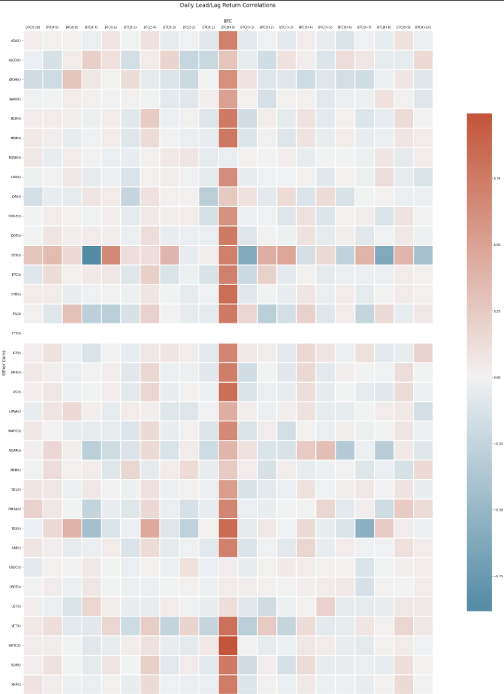
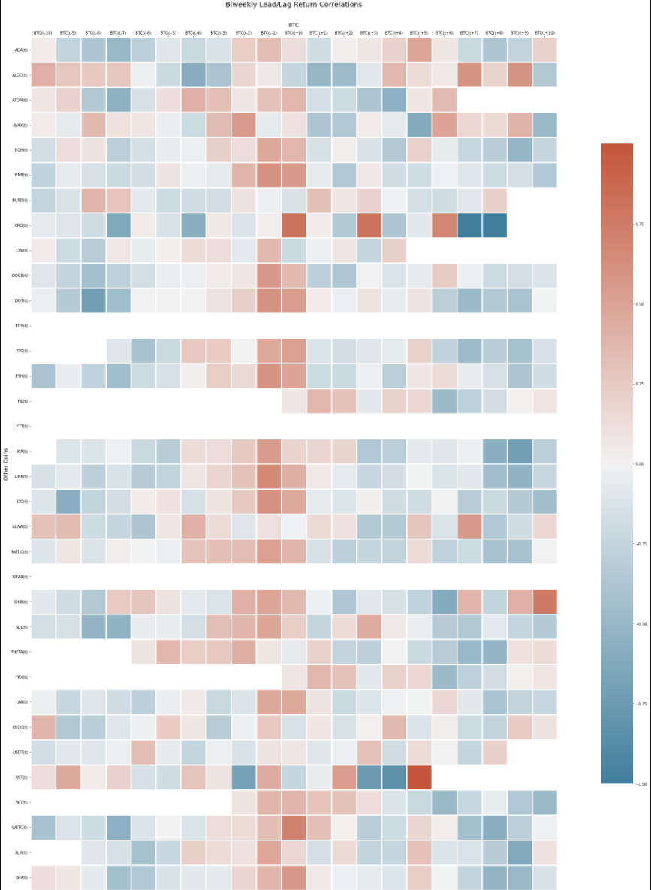
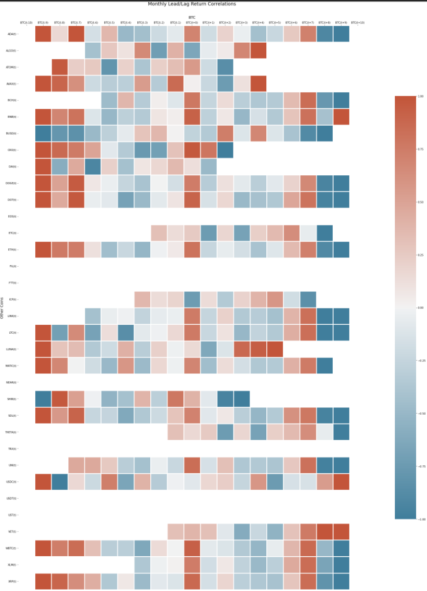

## Team DiamondHands 
### Welcome to our [team project website!](https://julioveracruz.github.io/testwebsite/)

This is a website to showcase our analysis of research directed at determining possible correlations between Bitcoin and a variety of other cryptocurrencies.
(In pursuit of our final project for FIN 377 - Data Science for Finance at Lehigh University)

To see the complete analysis file(s) click [here](https://github.com/LeDataSciFi/project-diamond-hands/blob/main/Final%20Components/final_report_notebook.ipynb).

## Table of contents
1. [Introduction](#introduction)
2. [Methodology](#meth)
3. [Section 2](#section2)
    1. [Subsection](#subsec2-1)
    2. [Subsection](#subsec2-2)
4. [Analysis Section](#section3)
5. [Summary](#summary)
6. [About Us](#AtT)

## Introduction  <a name="introduction"></a>

The main goal of this project is to explore potential price movement correlations between Bitcoin and a variety of other cryptocurrencies.
This research aimed to predict price movement using:
1. Leading Indicators
1. Lagging Indicators
    
## Methodology <a name="meth"></a>

Here is some code that we used to develop our analysis. [More details are provided in the Appendix](page2).
Displayed below is the primary code which is used to download pricing information for the cryptocurrencies under investigation
- Note: All data is sourced from [CoinMarketCap.com](https://coinmarketcap.com/) and their proprietary API system

```python

coin_list = []
temp_list = []
str = 'https://coinmarketcap.com/historical/{}/'
final_df = pd.DataFrame()
counter = 0

sleepOne = 0.5
sleepTwo = 6
curr_int = 0
from tqdm import tqdm
import random
while ((counter < days_loop) and (curr_int < end_int)):
    counter+=1
    try:
        date = datetime(year=int(curr_date[0:4]), month=int(curr_date[4:6]), day=int(curr_date[6:8]))    
        date += timedelta(days = 1)
        s = date.strftime("%Y%m%d")
        curr_date = s
        curr_int = int(curr_date)
        final_df = data_merge(curr_date,final_df,str,s)
        print("Date", curr_date)
        time.sleep(sleepOne)
        print("Slept for:", sleepOne)
    except ValueError:
        time.sleep(sleepTwo)
        date -= timedelta(days = 1)
        s = date.strftime("%Y%m%d")
        curr_date = s
        print("Curr_date", curr_date)
        counter-=1
        print("Slept for:", sleepTwo)
```

Notice that the output does NOT show! **You have to copy in figures and tables from the notebooks.**

## Section <a name="section2"></a>
Geberal Summary of Analysis

### Subsection 1 <a name="subsec2-1"></a>
Pricing data was obtained for all coins.
(Cryptocurrencies usually trade 24 hours per day, and thus the adjusted close value accounts for this)
Daily, weekly, and monthly returns were then imputed given the procong data.
### Subsection 2 <a name="subsec2-2"></a>
Using the calculated returns, correlation analysis was conducted to determine the significance of the correlation between Bitcoin and each additional cryptocurrency. 

## Analysis Section <a name="section3"></a>

Here are some graphs that we created in our analysis. We saved them to the `pics/` subfolder and include them via the usual markdown syntax for pictures.


<br>

<br>

<br>

<br>

<br>

<br>

<br>


## Summary <a name="summary"></a>

Current research and analysis suggests that other cryptocurrencies are unable to reliably and accurately predict Bitcoin price fluctuations. Current analysis suggests there are no signigicant arbitrage opportunities using this method.


## About the Team <a name="AtT"></a>
---
### Harrison Sneddon
#### [LinkedIn](https://www.linkedin.com/in/harrison-sneddon/)


<br>
Harrison is a senior at Lehigh University studying finance and international economic relations.

- Current Employer: Analyst, Raymond James & Associates
- Career Track: Investment Banking, M&A. Industrial Technologies and Tech Enabled Services.
---       
### Theo Faucher
#### [LinkedIn](https://www.linkedin.com/in/theo-faucher-b98581173/)


<br>
Theo is a senior at Lehigh University studying finance and economics.

- Current Employer: Analyst, Cadent Consulting Group
- Career Track: Strategy Consulting
---
### Ian Rosen
#### [LinkedIn](https://www.linkedin.com/in/ianrosenr/)


<br>
Ian is a junior at Lehigh University studying finance and computer science.

- Current Employer: Summer Analyst, Stifel Financial
- Career Track: Diversified Institutional Advisory Services
---


To view the GitHub repo for this website, click [here](https://github.com/donbowen/teamproject).
